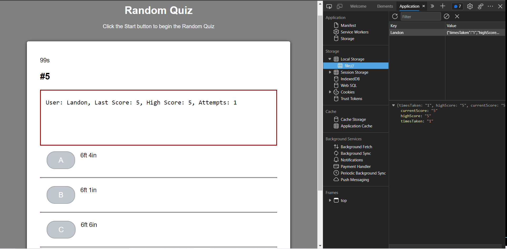

# Random Quiz

## Task

I was given the task of building a timed coding quiz with multiple-choice questions. This app runs in the browser and feature's dynamically updated HTML and CSS powered by JavaScript code that I wrote. It has a clean, polished, and responsive user interface. 

This week’s coursework activities have helped me to succeed in this assignment.

## User Story

```
AS A Dad
I WANT to take a timed quiz on random facts a child might ask that also stores high scores
SO THAT I can gauge my progress compared to my peers.
```

## Acceptance Criteria

```
Given this is a Random Quiz, when the start button is clicked the user is asked for a username that is used to keep track of stats. Once a response is given, the timer starts and the first question and set of answers  are dispayed. Whem a question is answered, another question is presented. When a question is answered incorrectly the timer continues to decrement.When all questions are answered or the timer reaches 0, the game is over and the user stats are stored and displayed.
```

## Screen-Shot

The following Image is a screen shot of the Random Quiz showing the final display and the localy stored object:




## Review

I tried to perform more encapsulization within the javaScript code for this application compared to my previous developments, and did so from scratch. 
With the exception of the timer functions, all of the JS code is written from my original ideas, refering to activities and the internet for syntax only.
I modified the HTML and CSS from the Password Generator to create a GUI for this multiple choice quiz.

### Link to Deployment
https://llh9.github.io/Random-Quiz/

### Developer - Landon Hinkle
---

© 2021 Trilogy Education Services, LLC, a 2U, Inc. brand. Confidential and Proprietary. All Rights Reserved.
